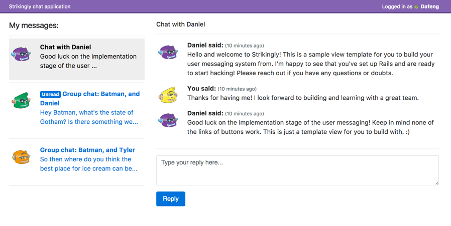

# Writing a messaging application



What we'd like is a simple messaging dashboard where users can talk with other users and search through their messages quickly, a lot like Wechat's group messaging. The application must be able to:

1. Organize messages by thread, sorted by their last response time.
2. Support multiple users chatting in the same thread.
3. Messages should be marked "unread" when the thread includes a response not seen, and marked as "read" when the message is opened.
4. Support listing thousands of messages efficiently
5. A user can only access messages sent to them, and messages they've sent.

## Getting started

We've provided a sample view page and some sample users to save you some time. 

If you haven't already, [install Ruby and PostgreSQL](https://gorails.com/setup/osx/10.12-sierra), once that's setup, it's time to get this running:
```bash
$ git clone git@cd.i.strikingly.com:strikingly/message-challenge.git  # clone the repository
$ cd message-challenge  # go into it
$ bundle install  # install the gems
$ rake db:setup  # setup the database
$ rails db:migrate  # migrate the DB
$ rails s  # start the server
```

And visit http://localhost:3000/ in your browser.

**Before you start development** please make sure to create a [feature branch](https://martinfowler.com/bliki/FeatureBranch.html) for your changes like so:

```
$ git checkout -b my-feature-branch-name
```

## Functional requirements

Please read through these carefully and ask if there is something you don't understand.

The goal is to have a web-based messaging system where users can reply to each other in a message thread. If a message thread is clicked, all replies in that thread should be displayed in chronological order. If a thread has a new reply that a user hasn't opened yet, it should be marked as "unread".

A message thread should support multiple users chatting in the same thread, like a Wechat group message. Each user in the thread should have their independent "unread" status. If a user is removed from the thread, they should no longer have access to view the message thread or create new messages for that thread.

## Technical requirements

In your implementation, we'd prefer you to constrain your solution to the main technologies currently used within Strikingly: Rails, Redis, Memcached, and PostgreSQL. You can create as many models as you'd like and add any gem that would speed up development. Some things to keep in mind:

- **Performance:** The system should be able to support many messages. Over 1000, no more than 10k. This scale usually reveals poor queries (e.g: [N+1 queries](http://guides.rubyonrails.org/active_record_querying.html#eager-loading-associations)) and prohivitively inefficient data design.
- **Security:** A user should not be able to reply or view a thread that they are not participating in. XSS attacks shouldn't be possible.

## Non-Requirements

- **Authentication:** You don't have to worry with the sign-out/sign-in/sign-up work. If you want to act as another user, you can modify the application_controller#current_user method with any of the default users: Dafeng, Xiaoyu, Daniel, Joyce, Tyler, Batman.
- **Interface for creating a new message:** Creating a new message thread can be done via the console. Be sure to describe how in your solution!
- **Flow for inviting new users to a message thread:** Inviting a new user to a thread can be done via console. Be sure to describe how in your solution!
- **Individual "user has read this" stamps:** In some messaging applications, when a user reads a message it notifies the origin message writer that it's been read. (e.g: "Seen at 8:12AM") This feature is not necessary here. The only timestamp required is when the message was originally sent.

## Deploying

Once you've completed your solution, it's time to show the world! To deploy, we suggest using [Heroku](heroku.com). If you don't already have an application created for you, please contact @tylerdiaz, @jc, or @daniel so they can set one up for you.

Once you've been invited. You need to install the Heroku Toolbelt. It's easy with homebrew:

```
brew install heroku
heroku login
```

Then, to push your code and test it:
```
heroku git:remote -a strikingly-training-{yourname}
git push heroku my-feature-branch-name:master
heroku run rake db:migrate
heroku run rake db:seed
heroku open
```

### Populating data on Heroku

`heroku run rails c` will give you a Rails console where you can create new records just as you would in code. Like so: `User.create!({ name: "Ruby" })`
